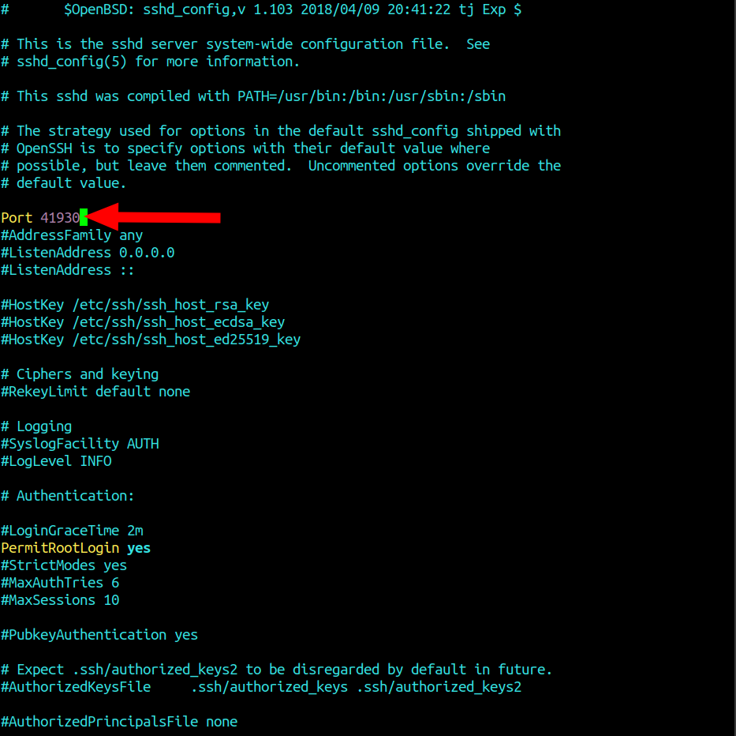
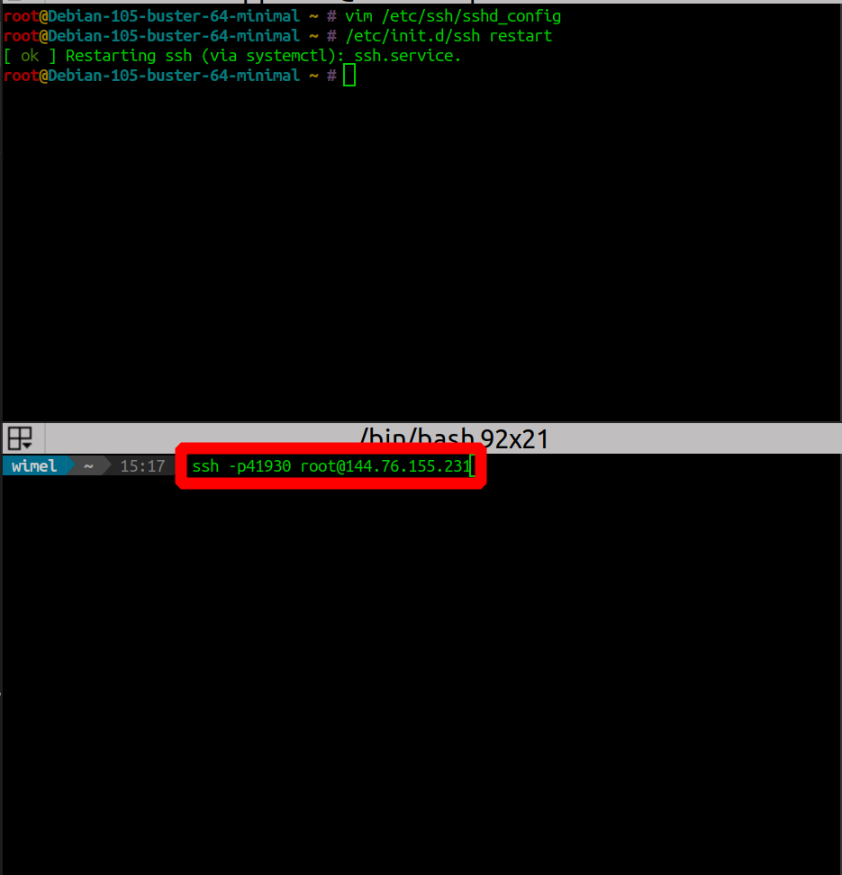
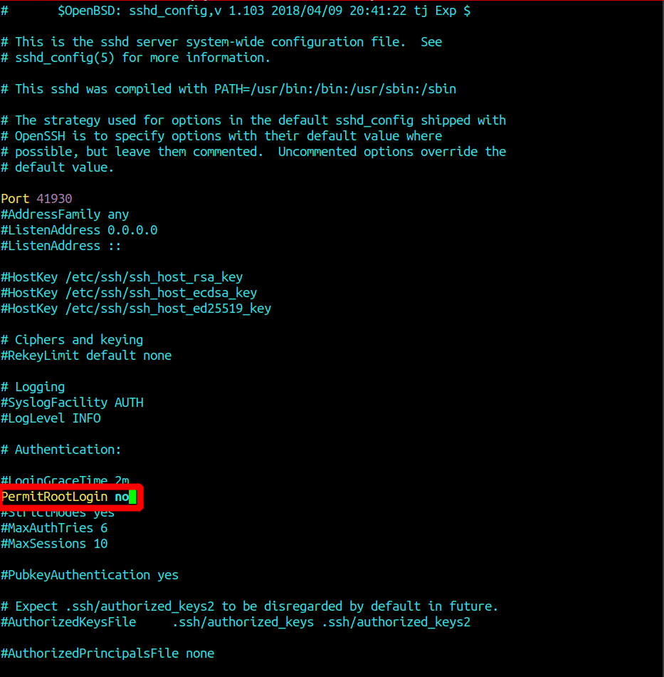
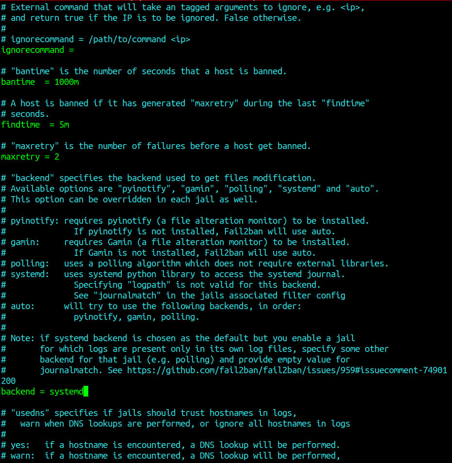
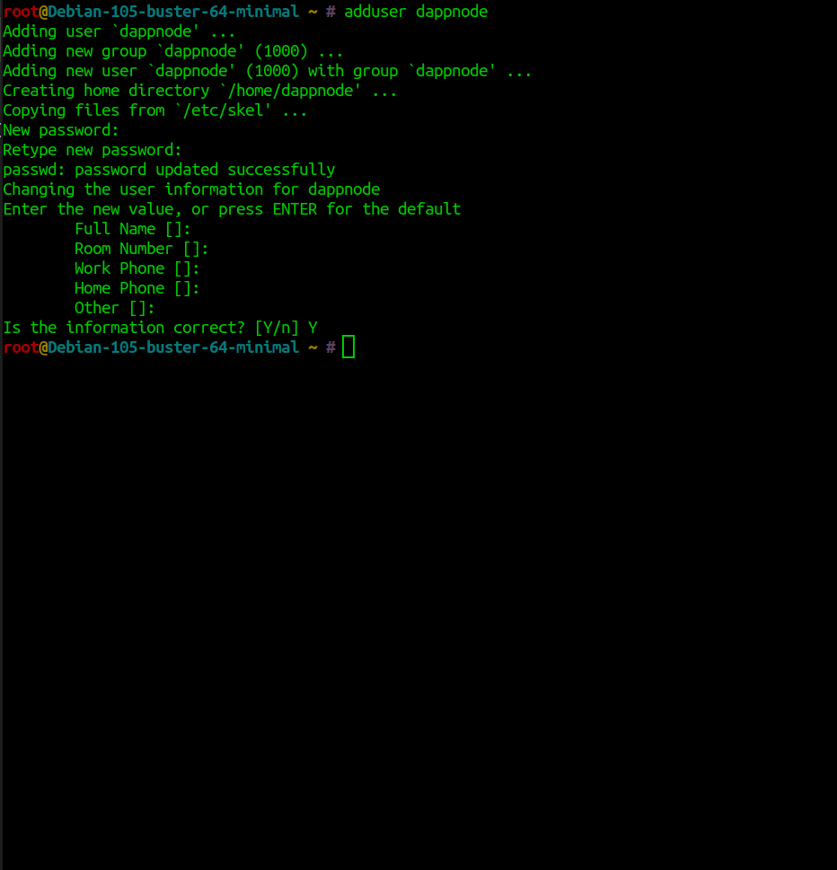
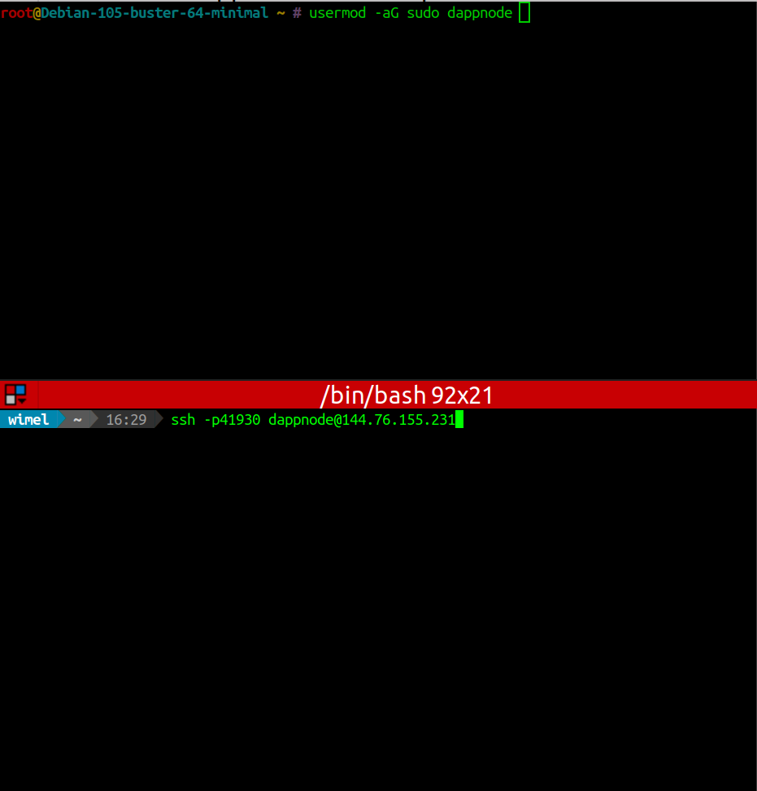
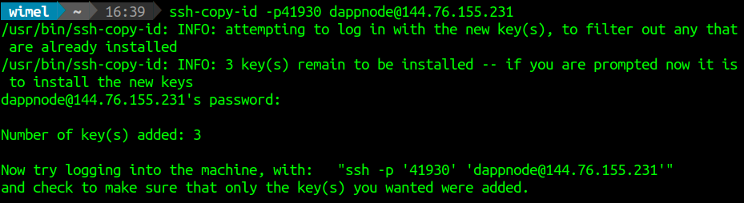
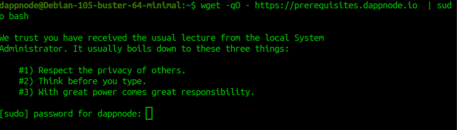
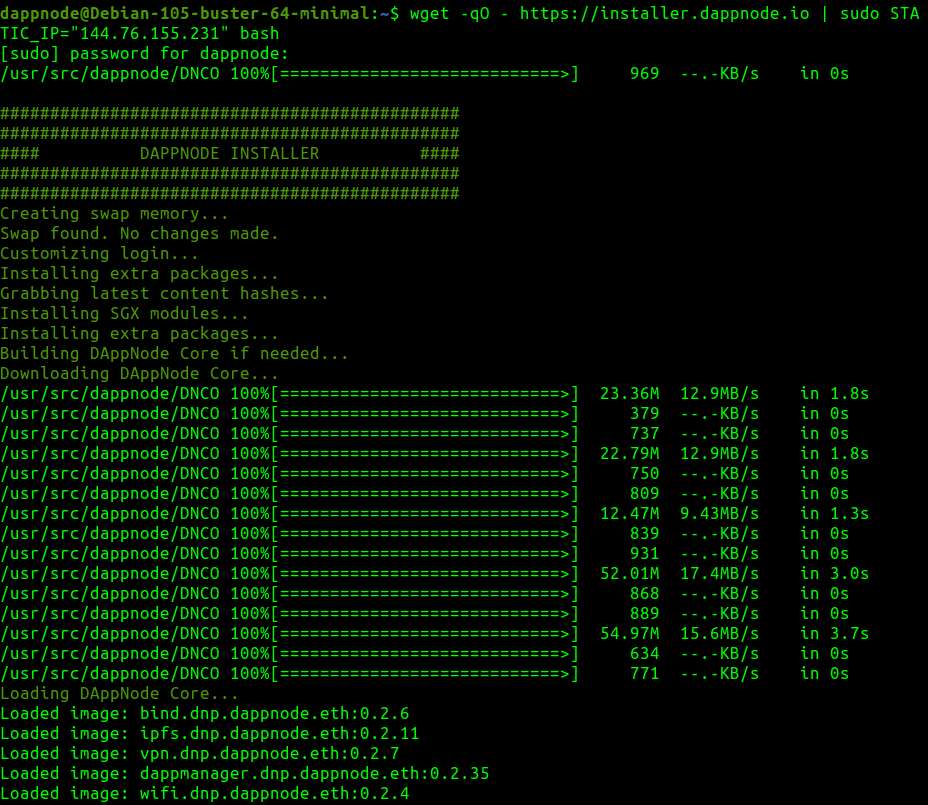

# DAppNodeWorkshop

## Repositorio para el workshop de DAppNode impartido por [Wimel](https://github.com/wimel) parte de [DelegaNetworks](https://delega.io/) y [ColmenaLabs_svq](https://www.colmenalabs.org/), el workshop será para la instalación y primeros pasos con [DAppNode](https://dappnode.io/) por lo que no se necesitan conocimientos avanzados, aún así le daremos un poco de seguridad a nuestro equipo.

### Requisitos: 

- Para este workshop el único requisito es tener un equipo con una versión mínima de [Debian](https://www.debian.org/) instalada, para el ejemplo se usará `Debian 10.5 minimal`. 

> También podemos usar la [ISO de DAppNode](http://iso.dappnode.io/), pero vamos a hacer las cosas por nosotros mismos controlando así nuestro sistema =).

#### Añadiendo un poco de seguridad a nuestro sistema.

> Estos pasos se realizan como [`root`](https://es.wikipedia.org/wiki/Root).

- Actualizamos el sistema e instalamos `sudo` _(al ser una versión minimal puede no estar instalado, la opción `-y` sirve para que no nos pregunte si estamos seguros)_:
```sh
apt update && apt -y upgrade && apt install -y sudo
```

- Cambiamos el puerto para acceder por [`ssh`](https://es.wikipedia.org/wiki/Secure_Shell), editando el archivo `sshd_config`, buscamos el puerto y lo modificamos _(línea5, en mi caso uso `vim` pero podéis usar `nano` o cualquier otro editor de textos)_ vamos a usar el puerto `41930`, pero podeis usar el que mas os guste _(normalmente Ethereum usa el puerto `30303` el cual tambien se puede modificar después, pero es mejor dejar el puerto por defecto para el nodo y cambiar el de acceso por `ssh`)_:

```sh
vim /etc/ssh/sshd_config
```



> Guardamos el archivo modificado y salimos del mismo.

- Reiniciamos el servicio `ssh` para que cargue la configuración nueva.

```sh
/etc/init.d/ssh restart
```

> La respuesta después de reiniciar el servicio `ssh` debería ser `[ ok ] Restarting ssh (via systemctl): ssh.service.`

> Desde ahora, si necesitamos volver a acceder a nuestro equipo por `ssh` debemos hacerlo por el puerto que hemos elegido _(como se muestra en la imagen siguiente)_, es importante **no cerrar la terminal anterior** desde la que habíamos cambiado el puerto y abrir una nueva para acceder usando el puerto seleccionado, pues si algo saliese mal no podríamos acceder.


- Una vez que hemos cambiado el puerto de `ssh` vamos a editar el mismo archivo y vamos a cambiar el valor `PermitRootLogin yes` por `PermitRootLogin no` para que no se pueda acceder como `root`, como antes guardamos y salimos.
 

- Como va a ser un equipo que va a estar expuesto en internet, vamos a instalar y configurar [`Fail2Ban`](https://www.fail2ban.org/wiki/index.php/Main_Page).
> Instalamos:
```sh
apt install fail2ban -y
```
> Configuramos `fail2ban`:
```sh
vim /etc/fail2ban/jail.conf
```
> Cambiamos las siguientes opciones:

 `bantime = 10m` por `bantime = 1000m` _(podemos poner más si queremos, este valor es el número en segundos que el host será baneado)_.

 `findtime = 10m` por `findtime = 5m` _(lo podemos bajar más si queremos, este valor lo que hará es banear al host si ha generado `maxretry` durante el `findtime`)_.

 `maxretry = 5` por `maxretry = 2` _(no bajar a menos de 2, este valor es el numero de inetntos fallidos que el host tendrá antes de ser baneado)_.


> Guardamos, salimos y como antes reiniciamos el servicio para que carge la configuración nueva:
```sh
service fail2ban restart
```

> Comprobamos que el servicio está funcionando correctamente con `service fail2ban status` la respuesta debería ser algo así:
```sh
● fail2ban.service - Fail2Ban Service
   Loaded: loaded (/lib/systemd/system/fail2ban.service; enabled; vendor preset: enabled)
   Active: active (running) since Fri 2020-11-20 16:10:06 CET; 10s ago
     Docs: man:fail2ban(1)
  Process: 15826 ExecStartPre=/bin/mkdir -p /var/run/fail2ban (code=exited, status=0/SUCCESS
 Main PID: 15827 (fail2ban-server)
    Tasks: 3 (limit: 4915)
   Memory: 12.5M
   CGroup: /system.slice/fail2ban.service
           └─15827 /usr/bin/python3 /usr/bin/fail2ban-server -xf start

Nov 20 16:10:06 Debian-105-buster-64-minimal systemd[1]: Starting Fail2Ban Service...
Nov 20 16:10:06 Debian-105-buster-64-minimal systemd[1]: Started Fail2Ban Service.
Nov 20 16:10:07 Debian-105-buster-64-minimal fail2ban-server[15827]: Server ready
```

> Si obtenemos un error en la respuesta, entramos en el mismo archivo de configuración de Fail2ban y modificamos `backend = auto` por `backend = systemd` _(ver imagen anterior)_.

#### Creación de usuario:

- Creamos el usuario dappnode nos preguntará la contraseña, pero no la veremos:
```sh
adduser dappnode
```


- Damos permisos de `sudo` al usuario `dappnode` que acabamos de crear:
```sh
usermod -aG sudo dappnode
```

- Accedemos _(como antes sin cerrar la terminal anterior)_ a nuestro equipo con el usuario nuevo usando el puerto que hemos puesto anteriormente.


> Si todo ha salido bien y podemos acceder con el usuario `dappnode` por el puerto asignado anteriormente, podemos cerrar la terminal en la cual iniciamos sesión como `root`.

> Tip: Si queremos que no nos pregunte la contraseña cada vez que accedemos a nuestro equipo por `ssh`, en la terminal de nuestro equipo introducimos lo siguiente _(esto es como si nuestros equipos se tomaran una cerveza juntos y se hicieran amigos, técnicamente lo que hace es copiar nuestra clave pública en la remota)_:
```sh
 ssh-copy-id -p41930 dappnode@IP
```


#### Instalación de DAppNode:

- Como la gente de DAppNode es tan way, este primer comando instala todos los requisitos, más info [aquí](https://github.com/dappnode/DAppNode/wiki/DAppNode-Installation-Guide#install-dappnode-prerequisites), _(nos saldrá un mensaje como la frase que le dice el abuelo de Peter Parker, pero realmente es una frase de Franklin D. Roosevelt el 11 de abril de 1945, dos días antes de morir en su último discurso)_, metemos la contraseña y nos instalará los requisitos:
```sh
wget -qO - https://prerequisites.dappnode.io  | sudo bash
```



- Instalamos DAppNode _(en caso de instalar DAppNode en un servidor (no recomendado) sería `wget -qO - https://installer.dappnode.io | sudo STATIC_IP="your static IP" bash`)_:
```sh
wget -qO - https://installer.dappnode.io | sudo bash
```


- Una vez que ha terminado de instalar lo necesario nos aparece un `QR` que podremos escanear con nuestro movil, o podemos usar la `URL` que nos aparece justo debajo, si estamos en la misma red que nuestro DAppNode, debemos modificar la primera parte por la `IP` del equipo en nuestra red.

> Para el uso de la `VPN` en nuestro sistema operativo en la [wiki de DAppNode](https://github.com/dappnode/DAppNode/wiki/OpenVPN-Client-Guide) podemos encontrar los pasos a seguir.

- Cuando hemos importado la `VPN` y una vez activda, podemos acceder a la web [http://my.dappnode](http://my.dappnode/), y nos irá guiando paso a paso con los siguientes pasos.

Desde ahora para instalar el nodo que queramos ya lo haremos desde la web de nuestro DAppNode [http://my.dappnode](http://my.dappnode) activando la `VPN`, a golpe de clic y sin comlicaciones, como hemos visto esta es la forma más sencilla de instalar y mantener el nodo de la red que queramos, espero que esta guía os sirva de ayuda!!. 

##### «Enlaces de interés»

[¿Qué es DappNode?(vídeo)](https://www.youtube.com/watch?v=dPoovW5tjzc)

[Web](https://dappnode.io/)

[Tienda](https://shop.dappnode.io)

[Twitter](https://twitter.com/dappnode)

[Blog](https://medium.com/dappnode)

[Repositorio](https://github.com/dappnode/dappnode)

[Wiki](https://github.com/dappnode/DAppNode/wiki)

[Wiki DappNodeSDK](https://github.com/dappnode/DAppNodeSDK/wiki)

[Documentación](https://dappnode.github.io/DAppNodeDocs)

[Versión ARM](https://github.com/dappnode/DAppNode/releases/tag/v0.2.39)

[Documentación ARM](https://github.com/dappnode/DAppNode/wiki/DAppNodeARM-Installation-Guide)

[Discord](https://discord.com/invite/g9k6vkW)

[Foro](https://forum.dappnode.io)

[Canal en Youtube](https://www.youtube.com/channel/UCKnEqk4yVMN_Z6B8ikloYYA/videos) 